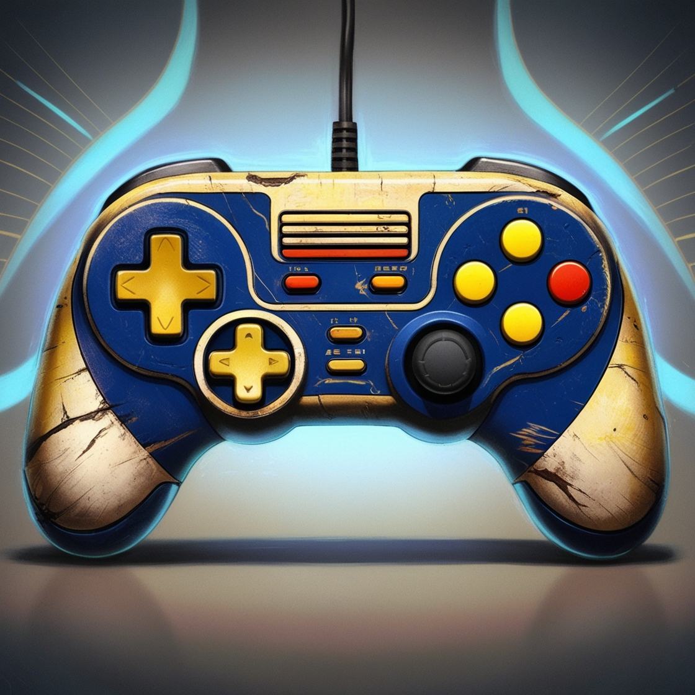

<h1 align="center">  Nostalgia Gamer: Sua viagem no tempo dos videogames!

---

## 📓 Descrição

Prepare-se para uma jornada nostálgica pelos consoles que marcaram gerações! A Nostalgia Gamer é uma aplicação web simples e intuitiva que te permite pesquisar por seus consoles favoritos e descobrir mais sobre eles. 

## ❓ Como funciona?

1. **Digite o nome do console:** Comece a digitar o nome do console que você procura na barra de pesquisa.
2. **Mágica da busca:** A aplicação irá procurar por correspondências no nome, descrição ou link de cada console cadastrado.
3. **Resultados instantâneos:** Em poucos segundos, você terá uma lista com os consoles que correspondem à sua pesquisa, com título, descrição e um link para saber mais.

## 🤖 Tecnologias Utilizadas

* **HTML:** A estrutura básica da página, onde tudo acontece!
* **CSS:** Responsável por deixar a aplicação com uma cara bonita e organizada.
* **JavaScript:** A mágica por trás da busca, onde a aplicação "ganha vida".

## 📁 Estrutura dos arquivos

* **index.html:** O arquivo principal, que você vê no navegador.
* **styles.css:** Contém todas as regras de estilo da aplicação.
* **app.js:** O coração da aplicação, com toda a lógica da busca.
* **dados.js:** Um arquivo onde você pode adicionar os dados de novos consoles (não incluso neste exemplo).

## ⭐ Começando a usar:

1. **Clone este repositório:** Faça um clone deste repositório para sua máquina.
2. **Abra o index.html:** Abra o arquivo index.html em seu navegador favorito.
3. **Comece a pesquisar:** Digite o nome do console e divirta-se!

## ✅ Dicas:

* **Personalize:** Sinta-se à vontade para personalizar a aplicação com suas cores, fontes e layout favoritos.
* **Adicione mais dados:** Edite o arquivo dados.js para adicionar mais consoles e informações.
* **Explore:** Descubra novas possibilidades com JavaScript e HTML!

** Contribuições:**

Quer ajudar a melhorar a Nostalgia Gamer? Sinta-se à vontade para abrir um pull request! Toda ajuda é bem-vinda!

**️ Divirta-se!**

Esperamos que você se divirta explorando a história dos videogames com a Nostalgia Gamer! 

**#nostalgia #videogames #webdev #html #css #javascript**

**Observação:** Este README foi criado de forma descontraída e informal, com o objetivo de ser fácil de entender para usuários de todos os níveis. 

**Para uma versão mais formal e completa, considere adicionar:**

* **Instruções mais detalhadas:** Sobre como clonar o repositório, instalar dependências (se houver) e executar a aplicação localmente.
* **Contribuições:** Um guia mais completo sobre como contribuir para o projeto, incluindo diretrizes de estilo e testes.
* **Licença:** Especifique a licença do projeto.
* **Agradecimentos:** Agradeça a qualquer pessoa que tenha contribuído para o projeto.

**Lembre-se de adaptar este README às suas necessidades específicas e ao público-alvo do seu projeto.**
